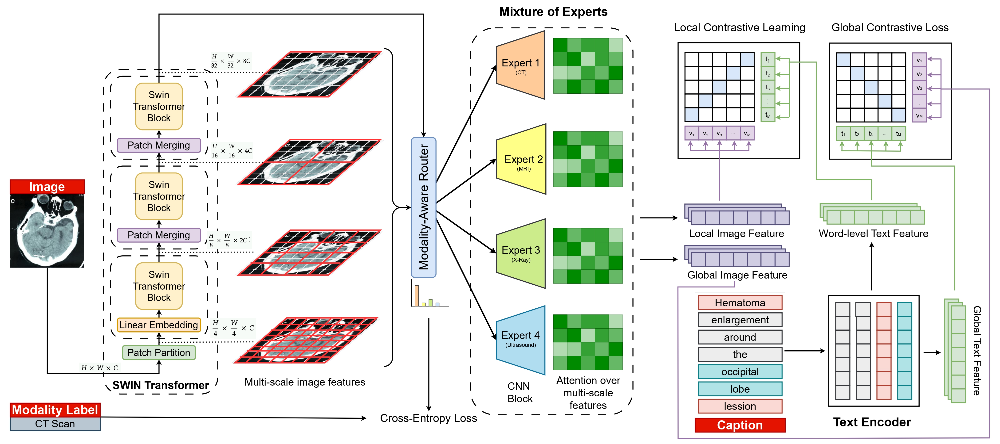

<h1 align="center">MedMoE: Modality-Specialized Mixture of Experts for Medical Vision-Language Understanding</h1>
<h3 align="center">(MMFM-BIOMED Workshop @ CVPR 2025)</h3>


<div style="font-family: charter;" align="center">
    <a href="https://shivangchopra11.github.io/" target="_blank">Shivang Chopra<sup>1</sup></a>,
    <a href="https://feola.bme.gatech.edu/people-2/gabriela-sanchez-rodriguez-2/" target="_blank">Gabriela Sanchez-Rodriguez<sup>1,2</sup></a>,
    <a href="https://lingchm.github.io/" target="_blank">Lingchao Mao<sup>1</sup></a>,
    <br>
    <a href="https://med.emory.edu/directory/profile/?u=AFEOLA2" target="_blank">Andrew J. Feola<sup>1,2,3</sup></a>,
    <a href="https://www.isye.gatech.edu/users/jing-li" target="_blank">Jing Li<sup>1</sup></a>,
    <a href="https://faculty.cc.gatech.edu/~zk15/" target="_blank">Zsolt Kira<sup>1</sup></a>,
    <br>
    <b><sup>1</sup>Georgia Institute of Technology, <sup>2</sup>Emory University, <sup>3</sup>Joseph M Cleland Atlanta VAMC</b>
</div>

<p align="center">
    
</p>

## Environment Setup
`conda env create --file=environment.yaml`

## Pretraining

### Single GPU
`python src/train.py experiment=pretraining_medmoe logger=wandb`

### Multi GPU
`python src/train.py --multirun experiment=pretraining_medmoe trainer=ddp trainer.devices=8 logger=wandb`

## Reference
```bibtex
@article{medmoe,
  title={MedMoE: Modality-Specialized Mixture of Experts for Medical Vision-Language Understanding},
  author={Shivang Chopra and Gabriela Sanchez-Rodriguez and Lingchao Mao and Andrew J. Feola and Jing Li and Zsolt Kira},
  booktitle={Workshop on Multimodal Foundation Models for Biomedicine in CVPR},
  year={2025}
}
```

## Acknowledgement
Our code repository is mainly built on [UniMed-CLIP](https://github.com/mbzuai-oryx/UniMed-CLIP) and [lightning-hydra-template](https://github.com/ashleve/lightning-hydra-template). We thank the authors for releasing their code.
